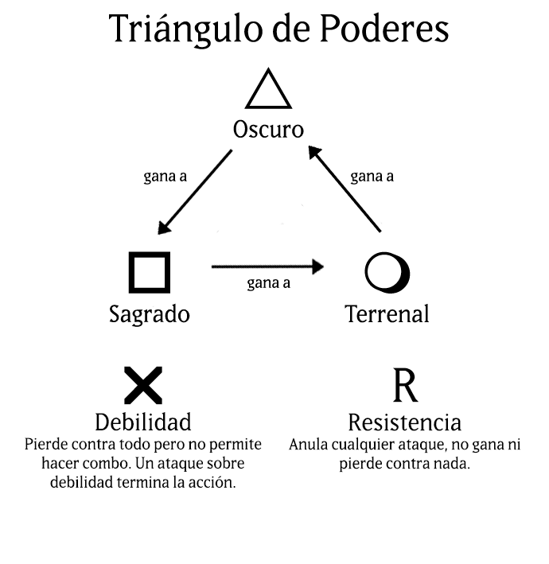

# *Rodillo´s Gaming Studio*

# GAME DESIGN DOCUMENT DE TRISKEL

# 1. INTRODUCCIÓN 

<b>Equipo de Desarrollo: </b>
Nuestro equipo de desarrollo, Rodillo´s Games, está compuesto por los siguientes integrantes:
+ Departamento de <b>Programación</b>: Andrés y Manuel.
+ Departamento de <b>Diseño</b>: Javier y Laura.
+ Departamento de <b>Arte</b>: Daniel.

<b>Descripción: </b>
Juego de cartas multijugador englobado en el género de estrategia basado en turnos de 30 segundos (para dos jugadores). Cada jugador dispondrá de un mazo de 8 cartas, las cuales podrá escoger entre una baraja de 12 (número ampliable, se explica en <b>Monetización</b>).
Los mazos de cartas se corresponden con mitologías antiguas, conteniendo dioses y seres fantásticos relativos a cada una de ellas. Las mitologías contempladas son: <b>Griega</b>, <b>Egipcia</b> y <b>Nórdica</b>.

<b>Objetivo: </b>
El fin último de nuestro producto es <b>entretener</b>. Nos hemos decantado por juegos de cartas porque, en su mayoría, tienen jugadores experimentados y apenas casuales. 
Además, en este segmento de mercado son aficionados al <b>coleccionismo</b> e invierten dinero en ello, caso que se da en nuestro videojuego con la compra de cartas al estilo “Hazte con todos” de la serie Pokemon. 
Asimismo, atraerá a personas interesadas en mitologías antiguas, que es un tema muy recurrente en la actualidad (por ejemplo, mediante la serie Vikingos, la gente se ha interesado por la cultura nórdica)
Por lo tanto, es juego orientado a atraer a una comunidad de jugadores que, en principio, jueguen de forma indefinida.

<b>Plataformas y Regiones: </b>
PC y móvil.
Usando un navegador como intermediario.
  
<b>Background literario (Contexto argumental): </b>
Al inicio del juego, se mostrará una <b>pantalla de carga</b> con una breve historia sobre la razón de ser videojuego. Es la siguiente:
			*“En el fin de los tiempos, los dioses del hombre
			chocan y toda la tierra se ve arrastrada a una 
 			última contienda: la Guerra Sacra.
			Los dioses crearon al hombre, y ellos serán 
			quienes los destruirán pero, ¿quién será el
			responsable último de ello?
		  	Tal poder estará consagrado únicamente a 
      			Quienes demuestran tal capacidad destructiva.
		  	La batalla por el poder ha comenzado.”*
Como indica el relato, el mundo está llegando a su fin y en concreto la existencia del hombre. Pero, de entre todas las mitologías que existen, solo una de ellas tendrá el poder de destruir al último hombre vivo. Para ello, las divinidades y criaturas de las mitologías lucharán entre sí para demostrar su liderazgo.
Aquí empezaría el juego, justo en el contexto de las batallas entre mitologías.
  

# 2. ESTRUCTURA DEL JUEGO
<b>Pantallas: </b>
Menú principal, opciones, pantalla de juego, gameover y leaderboard.

<b>Modos de juego: </b>
Existirán 2 posibles modos de juego:
+ Clásico: se jugará en un tablero de 4x4.
+ Rápido: el tamaño del tablero disminuirá a 3x3.

<b>Controles mecánicos: </b>
…………

<b>Descripción de los personajes (Barajas de Mitologías): </b>
………..

<b>Puntuación: </b>
…………..

<b>Mecánicas de juego: </b>
La mecánica se basa en el juego "Piedra, papel, tijera". Es decir, habrá 3 atributos diferentes que podrá ganar o perder frente al resto de ellos. En nuestro caso, los atributos serán:
- Sagrado
- Terrenal
- Oscuro
Además de dos atributos extra:
- Debilidad
- Resistencia
Estos atributos pueden repetirse o no (es decir, podemos tener 1 unidad de cada tipo de atributo o tener los 4 atributos del mismo tipo.

<b>Botones: </b>
…………….

<b>Tablero de juego: </b>
El tablero, dependiendo del modo de juego, podrá ser de 4x4 (16 casillas) en el caso de modo clásico, o de 3x3 (9 casillas) en el modo rápido.
Dispone de casillas del tamaño de las cartas que será donde los jugadores irán colocando sus cartas. 
Al fondo del tablero se podrá ver una imagen escogida de forma aleatoria de un banco que contiene una imagen temática por cada mitología:
Griega: el Olimpo
Egipcio: desierto con pirámides
Nórdico: Asgard

<b>Calidad de las cartas: </b>
Dentro de cada mazo tendremos 3 tipos diferentes de cartas que, de mayor a menor calidad serán:
+ Dioses Primigenios
+ Dioses
+ Héroes
+ Criaturas 
| Dios primigenio > Dios > Héroe > Criatura |

La superioridad o inferioridad de una calidad de carta frente a otro se ve reflejada en este caso:
Si hay una carta de peor calidad con un atributo que gana frente al de una carta de mayor calidad, no ganará puesto que <b>la calidad de carta tiene prioridad</b> respecto a los poderes de los atributos.
   | Calidad de carta > poder de atributos |

<b>Atributos de las cartas: </b>
Cada una de las cartas tendrá cuatro atributos obligatorios, que pueden o no repetirse (es decir, puede que alguna carta no tenga algún atributo concreto).
Hay tres tipos de atributos básicos (Sagrado, Terrenal u Oscuro) y uno neutral (que puede tomar dos valores: Resistencia o Debilidad).

En el caso de los atributos neutrales, las cartas de tipo Dios Primigenio se salvan: solo las cartas de tipo Dios, Héroe o Criatura pueden tener atributos neutrales.
Entonces, ¿cómo abatir una carta de tipo Dios Primigenio? Esto se explica con detalle en Combos.

Los atributos se situarán cada uno en uno de los cuatro lados de la carta, de manera que solo afectarán a las cartas que sean adyacentes por dicho lado.
Los atributos funcionan de la siguiente manera:

<b>Cartas exclusivas: </b>
Serán cartas de cualquier tipo (Dioses Primigenios, Dioses, Héroes o Criaturas) que solamente podrán añadirse a la colección del jugador, para su uso en las partidas, mediante compra interna con la moneda del juego. Esto se explica en Sistema de Banca y Monetización.

<b>Turnos: </b>
Durante cada turno, el jugador podrá usar 1 carta. Si sus atributos ganan a los de alguna de las cartas adyacentes (y estas pertenecen al rival) el jugador tomará el control sobre ellas. Además, si dichas cartas a su vez ganan contra alguna otra de las del rival (y no han sido ganadas por debilidad), se seguirá tomando el control sobre ellas hasta que se llegue a una que no gane a ninguna.
Es decir, durante cada turno solo se toman en cuenta los atributos de la carta jugada que ganan a sus adyacentes, así como los de las cartas ganadas al rival en dicho turno.
Las partidas serán mejor de 3, dándose por terminadas cuando un jugador reúna 2 victorias.
También estará disponible el botón de rendición, que supondrá la retirada de la partida y la victoria inminente del contrincante.
Las reglas se podrán ampliar próximamente con mecánicas como cartas con habilidades o habilidades específicas de cada mitología.

<b>Fondos de tablero exclusivos: </b>
………..

# 3. LOGÍSTICA
<b>Planificación del proyecto: </b>
El proyecto ha sido desarrollado en un 

<b>Herramientas de desarrollo: </b>
Para el desarrollo se usará el motor de videojuegos *Phaser v3.20.1*
(https://phaser.io)
El Departamento de Arte y Diseño usará *Photoshop CC 19*.
El Departamento de Programación usará el editor de código *Visual Code Studio*.
El equipo entero alojará el proyecto en una cuenta de *GitHub*, y el editor de texto *Microsoft Word*, y servicios de mensajería (como *WhatsApp*, Correo Electrónico y *Discord*) para el contacto entre los miembros del equipo.
Para la edición de diagramas se ha usado la herramienta online *Draw.io*

<b>Estudio de mercado: </b>
……………

<b>Estimación de costes: </b>
……………..

<b>Distribución y Ventas: </b>
…………….

<b>Sistema de banca del juego: </b>
El sistema de banca se basa en monedas virtuales que podremos obtener de dos formas:
Ganando partidas
Microtransacciones (esto se explicará en Monetización)
Éstas se irán sumando a la cuenta del usuario y luego las podrá canjear por las cartas exclusivas.
La razón a ganar en cada partida dependerá de: si has vencido a tu oponente o no, y cuántas cartas del tablero están en tu poder al acabar ésta.

<b>Monetización: </b>
Nuestro proyecto es <b>FreeToPlay</b>, pero con microtransacciones que son las que derivarán los beneficios del mismo.
Es importante recalcar que no es un P2W (PayToWin), ya que será posible jugar con total normalidad tanto si se han realizado o no compras internas del juego, es decir, no brindará ninguna ventaja sobre el resto de usuarios. Tomamos esta decisión debido al rechazo general en la comunidad Gamer a este tipo de videojuegos.
Entonces, ¿qué beneficio obtengo si hago una compra? La diferencia está en que habrá mazos con cartas predeterminadas, a las que todos los jugadores tendrán acceso. Pero existirán las cartas exclusivas (que como indicábamos antes, no más poderosas pero sí con personajes nuevos) que solamente serán accesibles mediante pago. Con eso, nuestro objetivo es promover el coleccionismo, que es el sector al que queremos orientar el producto:
Si una persona quiere completar la colección, deberá pagar para ello. Pero se podrá jugar indiferentemente si quiere evitar los pagos.
Las microtransacciones para obtener las monedas son las siguientes:
+ 100 monedas 🡪 0.99 €
+ 600 monedas 🡪 4.99 €
+ 1500 monedas 🡪 9.99 €
+ 3000 monedas 🡪 19.99 €

Nota: las monedas no podrán ser compradas en otras cantidades.
Se realizarán mediante pago con tarjeta de crédito o de débito y siempre a través de la aplicación.

<b>Hosting (Alojamiento del proyecto): </b> 
El proyecto estará alojado en Github en el siguiente enlace https://github.com/RodillosGamingStudio/Triskel

Asimismo estará disponible para su ejecución en *itch.io* https://rodillos-gaming.itch.io/triskel 

y en Facebook Instant Games (solo puede verse desde una cuenta de *Developer*).

# 4. CONTACTO
<b>Contacto y Redes Sociales: </b>
Facebook: Rodillo´s Gaming
facebook.com/rodillos.gaming.9

Twitter: @RodillosGaming  
twitter.com/RodillosGaming

itch.io: Rodillos Gaming
rodillos-gaming.itch.io/

Youtube: Rodillos Gaming
youtube.com/channel/UCUaR00AHGi0U2Z7mT9jfVfw

email: rodillosgaming@gmail.com
